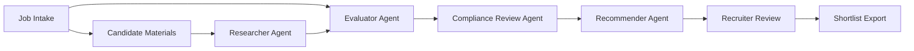

# Recruitment Assistant

A human-in-the-loop recruitment assistant built with a CrewAI-style multi-agent workflow. The application helps recruiters turn job requirements and candidate materials into structured candidate evaluations, ranked recommendations, interview focus areas, and auditable shortlist outputs.

This repository is currently Build-phase complete for the local MVP. Product and architecture context lives under `project-context/1.define/`, and Build implementation notes live under `project-context/2.build/`.

## Current Status

Build phase is complete for the local Recruitment Assistant MVP.

Implemented capabilities include:

- FastAPI backend with job intake, criteria update, analysis run, decision capture, health check, and Markdown/JSON export endpoints.
- CrewAI-compatible runtime configuration with externalized agent and task YAML files.
- Deterministic local analysis path for development and QA without live LLM credentials.
- SQLite persistence for jobs, runs, decisions, and audit-oriented workflow data.
- Static recruiter workbench frontend connected to the backend API.
- Browser-validated end-to-end flow from role intake through candidate ranking and export.

Known MVP limits:

- Candidate materials are pasted as text; PDF/DOCX upload parsing is declared but not wired into an upload endpoint yet.
- Live CrewAI kickoff is scaffolded but not enabled by default until provider credentials and prompt-trace policy are finalized.
- Authentication, authorization, background queues, encrypted shared storage, and production deployment hardening remain delivery or post-MVP work.

## Project Overview

Recruiting teams often work across fragmented job descriptions, resumes, profile links, notes, spreadsheets, ATS records, and hiring-manager conversations. This creates slow screening cycles, inconsistent candidate summaries, weak stakeholder alignment, and risk when AI-generated judgments are not explainable.

The Recruitment Assistant addresses that workflow by combining structured job intake, candidate analysis, compliance-sensitive review, and explainable shortlist generation. The system is designed to assist recruiters and hiring managers, not to make final hiring or rejection decisions automatically.

## Problem Statement and Value Proposition

Recruiters need to identify qualified candidates quickly while preserving accuracy, fairness, and traceability. Manual candidate sourcing and evaluation are inefficient because recruiters repeatedly normalize resumes, compare candidates without a consistent rubric, rewrite summaries for stakeholders, and preserve decision evidence by hand.

The core value proposition is to reduce manual sourcing and screening effort while improving the consistency, transparency, and evidence quality of candidate recommendations.

Expected value includes:

- Faster time from job intake to candidate shortlist.
- More consistent candidate matching against role criteria.
- Clear evidence for strengths, gaps, risks, and follow-up questions.
- Better recruiter and hiring-manager collaboration.
- Human-owned decisions with auditable AI assistance.

## Key Features

### MVP Features

- **Role intake and criteria builder**: Convert a job description into required criteria, preferred criteria, responsibilities, constraints, and screening rubric.
- **Candidate material ingestion**: Accept pasted candidate materials or uploaded resumes for analysis.
- **Candidate fact extraction**: Extract skills, experience, education, projects, employers, links, and supporting source snippets.
- **Automated candidate evaluation**: Compare each candidate against the same job rubric and identify strengths, gaps, risks, and confidence.
- **Ranked recommendations**: Produce an explainable ranked shortlist with rationale and human-review labels.
- **Compliance-sensitive review**: Flag protected-class inference, unsupported claims, discriminatory language, and automated decisioning risk.
- **Recruiter review and export**: Let recruiters review summaries, approve or revise recommendations, and export stakeholder-ready output.

### Deferred Features

- Full ATS integration.
- Candidate communication automation.
- Advanced analytics and reporting.
- Native job-board integrations.
- Interview scheduling integration.
- Enterprise SSO, RBAC, audit export, and configurable retention controls.

## Application Architecture Overview

The target runtime for the application is CrewAI, selected with `AAMAD_TARGET_RUNTIME=crewai`. The MVP uses a FastAPI backend, a dependency-free static frontend, SQLite local storage, and CrewAI-compatible agent/task configuration. The current API executes a deterministic local analysis service by default so the app can run reliably in local development and QA without model-provider credentials.

### Runtime Components

| Component | Location | Responsibility |
| --- | --- | --- |
| Frontend workbench | `frontend/index.html`, `frontend/app.js`, `frontend/styles.css` | Captures role intake and candidate text, calls the backend API, renders ranked results, saves decisions, and displays export output. |
| Backend API | `backend/app/main.py` | Exposes health, job, criteria, analysis run, decision, and export endpoints. |
| Workflow service | `backend/app/services.py` | Performs deterministic local candidate extraction, rubric matching, guardrail checks, ranking, and export generation. |
| Storage | `backend/app/storage.py`, `storage/recruitment_assistant.db` | Persists jobs, runs, decisions, and audit data in SQLite. |
| CrewAI configuration | `backend/app/crew/` | Defines CrewAI factory plus externalized agents and tasks for the future live runtime path. |

### Application Agents

| Agent | Role | Responsibility |
| --- | --- | --- |
| Role Intake Agent | Recruitment intake analyst | Normalizes job requirements into a structured rubric. |
| Researcher Agent | Candidate researcher and extractor | Searches, sources, or extracts candidate details from provided resumes, profile text, and approved public links. |
| Evaluator Agent | Candidate-job fit evaluator | Evaluates candidates against job criteria using the same rubric for every candidate. |
| Compliance Review Agent | Compliance and fairness reviewer | Checks recommendation language, protected-class risks, unsupported claims, and privacy concerns. |
| Recommender Agent | Shortlist and recommendation writer | Produces ranked recommendations, explains evidence, identifies missing information, and prepares recruiter-facing output. |

### Workflow



The system must preserve source evidence, label AI recommendations clearly, and require recruiter approval before candidate disposition or outreach.

## Getting Started

### Prerequisites

- Python 3.9 or newer.
- AAMAD installed for Define/Build workflow support.
- Backend Python dependencies from `backend/requirements.txt`.
- VS Code with GitHub Copilot if following the initialized IDE workflow.

### Environment Setup

From the `recruitment-assistant` directory, create a local environment file:

```bash
cp .env.example .env
```

Ensure the runtime target is set to CrewAI:

```bash
export AAMAD_TARGET_RUNTIME=crewai
```

Or keep it in `.env`:

```env
AAMAD_TARGET_RUNTIME=crewai
```

Install backend dependencies from the repository root virtual environment or your selected Python environment:

```bash
../.venv/bin/python -m pip install -r backend/requirements.txt
```

The local MVP can run without `OPENAI_API_KEY` because the backend uses deterministic analysis by default. Add provider credentials only when enabling the live CrewAI path.

### Run the Backend

From `recruitment-assistant`, start the FastAPI API:

```bash
AAMAD_TARGET_RUNTIME=crewai ../.venv/bin/python -m uvicorn backend.app.main:app --host 127.0.0.1 --port 8000
```

Check the API health endpoint:

```bash
curl http://127.0.0.1:8000/health
```

### Run the Frontend

The frontend is static HTML/CSS/JS. Serve it locally from `recruitment-assistant`:

```bash
../.venv/bin/python -m http.server 4173 --directory frontend
```

Open the workbench at:

```text
http://localhost:4173/
```

The frontend defaults to `http://localhost:8000` as the backend API base URL. If needed, edit the API URL field in the workbench; the value is persisted in browser local storage.

### AAMAD Repository Setup

This repository has already been initialized with AAMAD for VS Code:

```bash
aamad init --ide vscode
```

Define and Build artifacts are available at:

- `project-context/1.define/mrd.md`
- `project-context/1.define/prd.md`
- `project-context/1.define/sad.md`
- `project-context/2.build/backend.md`
- `project-context/2.build/frontend.md`
- `project-context/2.build/integration.md`
- `project-context/2.build/qa.md`

### Validate AAMAD Artifacts

From this project directory, run:

```bash
../.venv/bin/aamad validate --phase define
../.venv/bin/aamad validate --phase build
```

Build validation depends on the local AAMAD quality gates and may report documentation or delivery-phase gaps that are tracked separately from the completed local MVP implementation.

## Project Structure

```text
recruitment-assistant/
├── .cursor/                    # Shared AAMAD templates, prompts, rules, and agent definitions
├── .github/                    # VS Code / GitHub Copilot agents, prompts, and instructions
├── .vscode/                    # Workspace settings
├── backend/
│   ├── app/
│   │   ├── main.py             # FastAPI application and API routes
│   │   ├── services.py         # Recruitment analysis workflow service
│   │   ├── storage.py          # SQLite persistence
│   │   ├── guardrails.py       # Compliance-sensitive review helpers
│   │   └── crew/               # CrewAI factory and YAML agent/task config
│   └── requirements.txt        # Backend dependencies
├── frontend/
│   ├── index.html              # Recruiter workbench UI
│   ├── app.js                  # API integration and UI behavior
│   └── styles.css              # Workbench styling
├── project-context/
│   ├── 1.define/
│   │   ├── mrd.md              # Market Research Document
│   │   ├── prd.md              # Product Requirements Document
│   │   └── sad.md              # Solution Architecture Document
│   ├── 2.build/                # Build-phase implementation notes and QA artifacts
│   └── 3.deliver/              # Delivery artifacts to be produced later
├── storage/                    # Local SQLite and CrewAI storage directories
├── AGENTS.md                   # AAMAD persona index and workflow overview
├── CHECKLIST.md                # AAMAD execution checklist
├── README.md                   # Project README
└── aamad.config.example.yml    # Example AAMAD configuration
```

Delivery packaging, deployment documentation, and user-guide artifacts will be added under `project-context/3.deliver/` in the next phase.

## Success Metrics

The PRD defines these initial targets:

- Reduce recruiter first-pass screening time by at least 40% in pilot workflows.
- Reduce time from job intake to first shortlist by at least 30% for supported roles.
- Keep material factual correction rate below 10% in pilot review.
- Achieve recruiter task completion above 90% in usability testing.
- Achieve recruiter usefulness or trust rating above 4 out of 5.
- Keep structured output validation pass rate at or above 95%.

## Security and Compliance Notes

Candidate materials are sensitive personal data. The implementation must:

- Avoid automatic candidate rejection or advancement without human review.
- Avoid inferring or ranking by protected-class attributes.
- Redact candidate data from logs by default.
- Store secrets in environment variables, not code or artifacts.
- Preserve audit metadata for analysis runs and recommendations.
- Require legal and compliance review before any production deployment.

## Next Steps for Contributors

1. Run the security review for the completed local MVP.
2. Decide when to enable live CrewAI kickoff and define provider credential plus prompt-trace storage policy.
3. Add upload parsing endpoints for PDF/DOCX candidate materials if required for pilot use.
4. Prepare deployment and user-guide artifacts under `project-context/3.deliver/`.
5. Re-run AAMAD validation before delivery handoff.

## Source of Truth

Primary product requirements are documented in `project-context/1.define/prd.md`. Market and context assumptions are documented in `project-context/1.define/mrd.md`.
