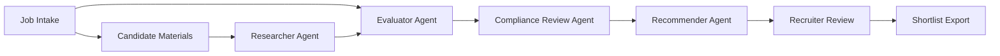

# Recruitment Assistant

A human-in-the-loop recruitment assistant built with a CrewAI-style multi-agent workflow. The application helps recruiters turn job requirements and candidate materials into structured candidate evaluations, ranked recommendations, interview focus areas, and auditable shortlist outputs.

This repository is currently in the AAMAD Define phase. Product context lives under `project-context/1.define/`, with the PRD as the primary source for MVP scope and implementation decisions.

## Project Overview

Recruiting teams often work across fragmented job descriptions, resumes, profile links, notes, spreadsheets, ATS records, and hiring-manager conversations. This creates slow screening cycles, inconsistent candidate summaries, weak stakeholder alignment, and risk when AI-generated judgments are not explainable.

The Recruitment Assistant addresses that workflow by combining structured job intake, candidate analysis, compliance-sensitive review, and explainable shortlist generation. The system is designed to assist recruiters and hiring managers, not to make final hiring or rejection decisions automatically.

## Problem Statement and Value Proposition

Recruiters need to identify qualified candidates quickly while preserving accuracy, fairness, and traceability. Manual candidate sourcing and evaluation are inefficient because recruiters repeatedly normalize resumes, compare candidates without a consistent rubric, rewrite summaries for stakeholders, and preserve decision evidence by hand.

The core value proposition is to reduce manual sourcing and screening effort while improving the consistency, transparency, and evidence quality of candidate recommendations.

Expected value includes:

- Faster time from job intake to candidate shortlist.
- More consistent candidate matching against role criteria.
- Clear evidence for strengths, gaps, risks, and follow-up questions.
- Better recruiter and hiring-manager collaboration.
- Human-owned decisions with auditable AI assistance.

## Key Features

### MVP Features

- **Role intake and criteria builder**: Convert a job description into required criteria, preferred criteria, responsibilities, constraints, and screening rubric.
- **Candidate material ingestion**: Accept pasted candidate materials or uploaded resumes for analysis.
- **Candidate fact extraction**: Extract skills, experience, education, projects, employers, links, and supporting source snippets.
- **Automated candidate evaluation**: Compare each candidate against the same job rubric and identify strengths, gaps, risks, and confidence.
- **Ranked recommendations**: Produce an explainable ranked shortlist with rationale and human-review labels.
- **Compliance-sensitive review**: Flag protected-class inference, unsupported claims, discriminatory language, and automated decisioning risk.
- **Recruiter review and export**: Let recruiters review summaries, approve or revise recommendations, and export stakeholder-ready output.

### Deferred Features

- Full ATS integration.
- Candidate communication automation.
- Advanced analytics and reporting.
- Native job-board integrations.
- Interview scheduling integration.
- Enterprise SSO, RBAC, audit export, and configurable retention controls.

## Application Architecture Overview

The target runtime for the application is CrewAI. The MVP should use a sequential workflow for reproducibility, testability, and auditability. Agent and task definitions should be externalized during Build according to the CrewAI adapter guidance.

### Application Agents

| Agent | Role | Responsibility |
| --- | --- | --- |
| Role Intake Agent | Recruitment intake analyst | Normalizes job requirements into a structured rubric. |
| Researcher Agent | Candidate researcher and extractor | Searches, sources, or extracts candidate details from provided resumes, profile text, and approved public links. |
| Evaluator Agent | Candidate-job fit evaluator | Evaluates candidates against job criteria using the same rubric for every candidate. |
| Compliance Review Agent | Compliance and fairness reviewer | Checks recommendation language, protected-class risks, unsupported claims, and privacy concerns. |
| Recommender Agent | Shortlist and recommendation writer | Produces ranked recommendations, explains evidence, identifies missing information, and prepares recruiter-facing output. |

### Workflow



The system must preserve source evidence, label AI recommendations clearly, and require recruiter approval before candidate disposition or outreach.

## Getting Started

### Prerequisites

- Python 3.9 or newer.
- AAMAD installed for Define/Build workflow support.
- CrewAI for the future application runtime.
- VS Code with GitHub Copilot if following the initialized IDE workflow.

### Current Repository Setup

This repository has already been initialized with AAMAD for VS Code:

```bash
aamad init --ide vscode
```

Define-phase artifacts are available at:

- `project-context/1.define/mrd.md`
- `project-context/1.define/prd.md`

### Validate Define Artifacts

From this project directory, run:

```bash
../.venv/bin/aamad validate --phase define
```

At the current stage, validation may report that `project-context/1.define/sad.md` is missing. That is expected until the architecture step is completed by `@system.arch`.

### Build Status

Application code has not been scaffolded yet. The next major step is architecture definition, followed by backend, frontend, integration, QA, and delivery work.

## Project Structure

```text
recruitment-assistant/
├── .cursor/                    # Shared AAMAD templates, prompts, rules, and agent definitions
├── .github/                    # VS Code / GitHub Copilot agents, prompts, and instructions
├── .vscode/                    # Workspace settings
├── project-context/
│   ├── 1.define/
│   │   ├── mrd.md              # Market Research Document
│   │   └── prd.md              # Product Requirements Document
│   ├── 2.build/                # Build-phase artifacts to be produced later
│   └── 3.deliver/              # Delivery artifacts to be produced later
├── AGENTS.md                   # AAMAD persona index and workflow overview
├── CHECKLIST.md                # AAMAD execution checklist
├── README.md                   # Project README
└── aamad.config.example.yml    # Example AAMAD configuration
```

Planned implementation structure will be defined in the SAD. Expected future areas include a CrewAI backend, recruiter workbench frontend, API integration layer, tests, and deployment documentation.

## Success Metrics

The PRD defines these initial targets:

- Reduce recruiter first-pass screening time by at least 40% in pilot workflows.
- Reduce time from job intake to first shortlist by at least 30% for supported roles.
- Keep material factual correction rate below 10% in pilot review.
- Achieve recruiter task completion above 90% in usability testing.
- Achieve recruiter usefulness or trust rating above 4 out of 5.
- Keep structured output validation pass rate at or above 95%.

## Security and Compliance Notes

Candidate materials are sensitive personal data. The implementation must:

- Avoid automatic candidate rejection or advancement without human review.
- Avoid inferring or ranking by protected-class attributes.
- Redact candidate data from logs by default.
- Store secrets in environment variables, not code or artifacts.
- Preserve audit metadata for analysis runs and recommendations.
- Require legal and compliance review before any production deployment.

## Next Steps for Contributors

1. Run `@system.arch` to create `project-context/1.define/sad.md` from the PRD.
2. Define evaluation criteria for accuracy, latency, safety, privacy, cost, and recruiter usefulness.
3. Scaffold the CrewAI backend using sequential agent/task configuration.
4. Build the recruiter workbench UI for job intake, candidate upload or paste, analysis status, comparison, review, and export.
5. Connect frontend and backend through a minimal API contract.
6. Add test data with anonymized or synthetic candidate profiles.
7. Validate the MVP with QA, security review, and AAMAD phase validation.
8. Prepare deployment and user-guide artifacts under `project-context/3.deliver/`.

## Source of Truth

Primary product requirements are documented in `project-context/1.define/prd.md`. Market and context assumptions are documented in `project-context/1.define/mrd.md`.
